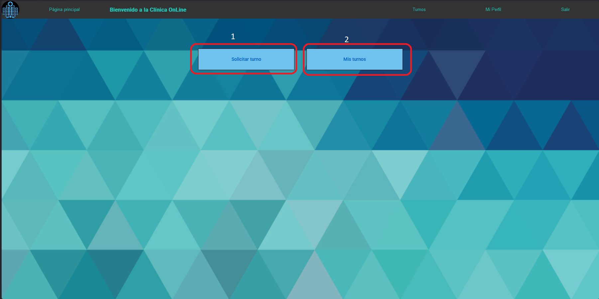

# ClinicaOnline

This project was generated using [Angular CLI](https://github.com/angular/angular-cli) version 20.0.2.

## Página de inicio
Accede con tu cuenta o crea una nueva para poder utilizar las funciones de la Clínica Online

### 1 Registrarse: Si no tenés una cuenta registrada podés crear haciendo click en esta opción, 
### 2 Ingresar: Si ya posees una cuenta haz click en esta opción para acceder.

## Menú principal
Una vez que entres con tu cuenta podrás ver las distintas opciones disponibles

### 1 Turnos: click acá p.ara acceder al menú de turnos, donde podés ver tus turnos o solicitar uno nuevo

### 2 Mi Perfil: click acá para acceder a los detalles de tu cuenta.

### 3 Salir: Cierra tu sesión haciendo click acá.

# Mi perfil
Muestra todos los datos de tu perfil

# Turnos

### 1 Solicitar turno: click en este botón para poder pedir un nuevo turno
### 2 Mis turnos: click en este botón para revisar todos sus turnos pendientes y finalizados

## Solicitar turno
En este menú podrá preparar su turno paso a paso
## Especialidad

### 1 Click en uno de los botones para seleccionar la especialidad 

## Especialista

### 1 Click en uno de los botones para seleccionar al especialista disponible

## Fecha y hora

### 1 Click en la hora para desplegar las horas disponibles
### 2 Click en la hora deseada para seleccionarla
### 3 Click en el botón para terminar el proceso y pedir el turno

## Mis turnos
En este menú podrá ver los detalles de sus turnos finalizados y pendiente, ademas de contar con la posibilidad de cancelar los turnos pendientes

### 1 Puede filtrar los turnos mostrados escribiendo en este espacio. Se le mostrará los turnos que posean la palabra escrita.
### 2 Para cancelar su turno escriba el motivo en la caja de texto de la izquierda y luego clique en 'Cancelar'

# Para los especialistas
## Turnos
El botón de turnos de la página principal le llevará a la sección de 'Mis turnos' donde podrá visualizar todos los turnos realizados, cancelados y pendientes

### 1 Puede filtrar los turnos mostrados escribiendo en este espacio. Se le mostrará los turnos que posean la palabra escrita.
### 2 Clique en uno de estos botones para aceptar, rechazar o finalizar el turno (Debe completar la reseña o comentario antes de poder seleccionar 'Rechazar' o 'Finalizar').
### 3 Escriba en la caja de texto correspondiente el motivo de rechazo o la reseña de la consulta

# Para los administradores
Como administrador contará con el menú adicional 'Usuarios' donde podrá visualizar y descargar datos de los usuarios de la Clínica Online, ademñas de poder dar de alta a un nuevo usuario.

### 1 Clique aquí para acceder al menú adicional.

## Usuarios

### 1 Crear nuevo usuario: clique aquí para dar de alta a un nuevo usuario, como administrador está habilitado para dar de alta a un nuevo administrador.
### 2 Descargar hoja de cálculo: clique aquí para descargar una hoja de cálculo con todos los datos de los usuarios.
### 3 Descargar registro de ingresos: clique aquí para descargar una hoja de cálculo con el registro de todos los ingresos de los usuarios.
### 4 Clique en el botón 'Cambiar' para verificar o bloquear la cuenta del usuario en la fila correspondiente.

